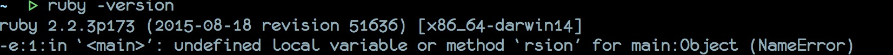
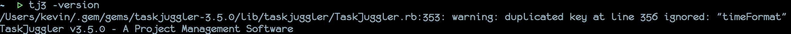

<h2>Table of Contents</h2>

<ul>
<li><a href="#sec-1">1. Taskjuggler安装</a>
<ul>
<li><a href="#sec-1-1">1.1. Ruby安装</a>
<ul>
<li><a href="#sec-1-1-1">1.1.1. 软件安装</a></li>
<li><a href="#sec-1-1-2">1.1.2. 安装完成验证</a></li>
<li><a href="#sec-1-1-3">1.1.3. 配置Ruby的gem环境</a></li>
</ul>
</li>
<li><a href="#sec-1-2">1.2. Taskjuggler安装</a></li>
</ul>
</li>
</ul>

# Taskjuggler安装

本书以Taskjuggler3.5.0版本为基础，它使用Ruby进行开发，因此安装它之前需要先安装Ruby环境，需要的Ruby为至少2.0以上。

## Ruby安装

### 软件安装

-   Windows
    打开下载地址：<http://dl.bintray.com/oneclick/rubyinstaller/rubyinstaller-2.2.3.exe>， 下载最新的ruby安装包，这里下载的是
-   Linux
    在Linux上不同的软件管理都有不同的安装命令，这里给出几种常用的在线安装方式

    // Archlinux
    sudo pacman -S ruby
    // Fedora, Redhat
    sudo yum install ruby
    // Ubuntu, Debain
    sudo apt-get install ruby

-   MacOS
    MacOS中可以使用brew来进行安装，而对于brew的安装，用户可以网上搜索找到相关的信息，安装完成brew后，可以在终端内，用以下命令则可以安装：

    brew install ruby

-   编译安装
    另外可以直接在除Windows平台上，采用源码编译安装的方式。
    首先先下载源码包：<https://cache.ruby-lang.org/pub/ruby/2.2/ruby-2.2.3.tar.gz>， 然后解压进入编译安装，Linux和MacOS的编译安装方式命令都相同：

    tar xvf ruby-2.2.3.tar.gz
    cd ruby-2.2.3
    ./configure
    make && make install

### 安装完成验证

安装完成后，需要对Ruby进行一下安装成功与否的验证，验证方法如下：
Windows打开cmd，Linux和MacOS可以打开终端，执行如下命令：

    ruby -version

如果正常打印出如下版本信息，则说明Ruby安装成功。

### 配置Ruby的gem环境

由于ruby的在线安装源在国内访问不了，因此需要将软件源更新为国内的，我们选择使用Taobao的Ruby软件源，因此需要在安装完成Ruby后，修改掉官方提供的软件更新源，具体更新办法如下：（Windows打开cmd, Linux和MacOS打开终端）

    gem sources --remove https://rubygems.org/
    gem sources -a https://ruby.taobao.org/
    gem sources -l

## Taskjuggler安装

安装完成Ruby后，则可以直接使用gem进行在线安装最新版本的Taskjuggler，依然是Windows打开cmd, Linux和MacOS打开终端：

    gem install taskjuggler

安装完成后，使用如下命令验证是否安装成功：

    tj3 -version

打印出如下taskjuggler的版本信息，则说明安装成功。

